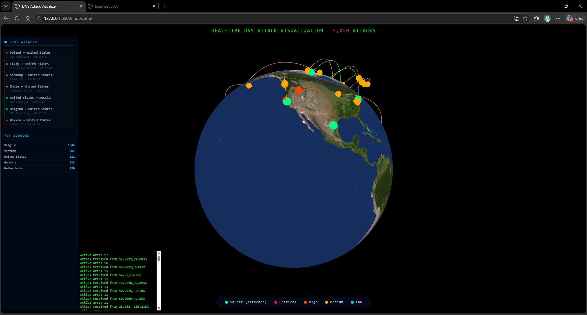

# Real-Time Global DNS Attack Visualization System

This project visualizes real-time or simulated DNS/cyberattack activity on a 3D globe using Python, Blender, Three.js, and Globe.gl.

## Features

- 3D globe model created in Blender (`earth.glb`)
- Real-time animated attack visualization between source and target locations
- Python server using Flask-SocketIO for data streaming
- Browser-based rotating 3D globe visualization
- Simulated/live attack event generation for testing visualization
- Attack severity indicators and animated attack arcs
- Real-time attack activity panel with recent attack updates

## Requirements

- Python 3.x
- Blender (for model creation)
- Web browser with WebGL support

## Installation

1. Install Python dependencies:

```bash
pip install flask flask-socketio requests
```

## Usage

1. Run the server:
   ```bash
   python server.py
```

2. Open index.html in your web browser.

3. The system displays animated real-time/simulated DNS attack activity on the 3D globe.

## Files

- `server.py`: Python server handling attack event generation and data streaming
- `main.js`: Three.js client for 3D visualization and attack animations
- `index.html`: Main frontend page
- `style.css`: Styling
- `earth.glb`: Blender 3D globe model
- `screenshot.png`: Current project preview

## Data Source

The project currently uses simulated/live attack event generation for visualization and testing of DNS/cyberattack activity on the globe.

## Customization

- Modify attack simulation logic in `server.py`
- Adjust visualization parameters in `main.js`
- Enhance the Blender model for better textures

## Skills Used

- Python networking and backend handling
- Blender 3D modeling
- Three.js WebGL programming
- Socket.IO real-time communication
- Real-time data visualization
- Basic cybersecurity visualization concepts

## Current Project Preview


